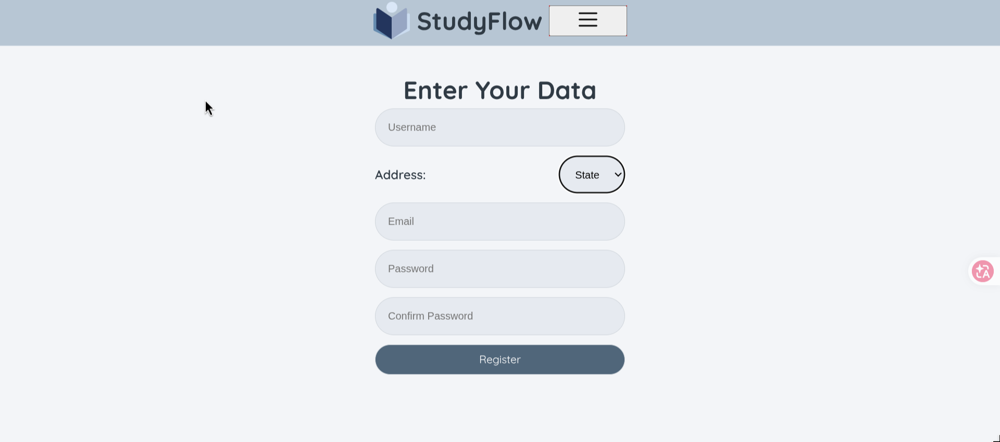
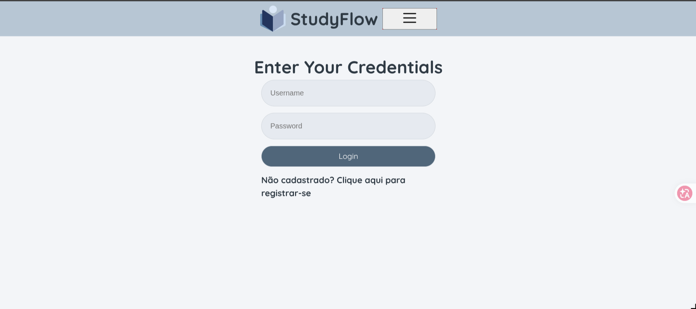
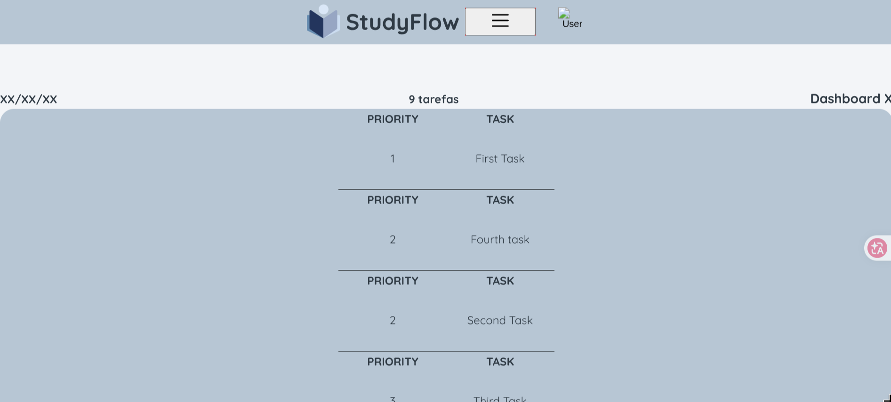

# CSI606-2026-01 - Remoto - Proposta de Trabalho Final

**Discente:** Athus Silva Souza - 22.2.8079

## Resumo

O projeto **StudyFlow** é uma aplicação web Full-Stack voltada para organização de estudos, tarefas acadêmicas e sessões de foco. A proposta busca auxiliar estudantes na estruturação da rotina de aprendizado, centralizando em uma única plataforma o planejamento de atividades, o acompanhamento de progresso e a visualização de informações relevantes para a gestão do tempo.

O sistema foi organizado com uma arquitetura separada entre frontend e backend. A interface é construída com **React**, **TypeScript** e **Vite**, enquanto a API é implementada com **Node.js**, **Express** e **Prisma**, utilizando **PostgreSQL** para persistência de dados. O objetivo é aplicar os conteúdos trabalhados na disciplina, incluindo rotas, componentes, API REST, banco de dados e organização modular do projeto.

## 1. Tema

O trabalho final tem como tema o desenvolvimento de uma aplicação web para gerenciamento de estudos. O foco está na organização de tarefas, sessões de foco e acompanhamento de progresso, oferecendo ao usuário uma forma simples de planejar e monitorar sua rotina acadêmica.

## 2. Escopo

O projeto terá as seguintes funcionalidades:

**Módulo de Autenticação**

- Cadastro de usuário.
- Login de usuário.
- Proteção de rotas privadas no frontend.
- Redirecionamento automático entre páginas públicas e privadas.

**Módulo de Tarefas**

- Cadastro de tarefas de estudo.
- Listagem de tarefas.
- Atualização de status da tarefa.
- Remoção de tarefas.
- Organização por estado, como pendente, em andamento ou concluída.

**Módulo de Sessões de Foco**

- Registro de sessões de estudo.
- Associação de sessões a tarefas ou assuntos.
- Histórico simples de sessões realizadas.

**Módulo de Dashboard**

- Tela inicial do usuário autenticado.
- Resumo de tarefas.
- Indicadores simples de progresso.
- Acesso rápido às principais áreas da aplicação.

**Infraestrutura Backend**

- API REST em Node.js e Express.
- Persistência de dados com Prisma e PostgreSQL.
- Separação entre rotas, controllers e camada de acesso ao banco.

## Funcionalidades implementadas

- Cadastro e login de usuários.
- Rotas públicas e privadas no frontend.
- CRUD de dashboards de estudo.
- CRUD de tarefas associadas a dashboards.
- Atualização de status das tarefas.
- Reordenação simples de dashboards e tarefas por prioridade.
- Registro e remoção de sessões de foco.
- Resumo no dashboard com total de tarefas, tarefas concluídas, pendentes e minutos de foco.

## 3. Restrições

Neste trabalho não serão considerados:

- Aplicativo mobile nativo.
- Sincronização offline.
- Notificações push.
- Integração com calendário externo.
- Gamificação avançada.
- Compartilhamento de planos de estudo entre usuários.
- Relatórios estatísticos complexos.

## 4. Protótipos

Protótipos funcionais para as páginas principais estão sendo codificados no diretório `frontend-web` deste repositório.

Estrutura atual do frontend:

- **Rotas da aplicação:** `frontend-web/src/routes/`
- **Página de Login:** `frontend-web/src/pages/Login/`
- **Página de Cadastro:** `frontend-web/src/pages/Register/`
- **Dashboard:** `frontend-web/src/pages/Dashboard/`
- **Página de Usuário:** `frontend-web/src/pages/User/`
- **Componentes comuns:** `frontend-web/src/components/common/`
- **Assets visuais:** `frontend-web/src/assets/`

Estrutura atual do backend:

- **Entry point da API:** `server/src/server.js`
- **Configuração do Prisma:** `server/prisma.config.ts`
- **Schema do banco:** `server/prisma/schema.prisma`
- **Controllers:** `server/src/controller/`
- **Rotas:** `server/src/routes/`

A interface utiliza React com Vite, TypeScript e React Router DOM. O backend utiliza Node.js, Express, Prisma e PostgreSQL.

## 5. Referências

EXPRESS. **Express - Node.js web application framework**. Disponível em: <https://expressjs.com/>.

META. **React Documentation**. Disponível em: <https://react.dev/>.

PRISMA. **Prisma Documentation**. Disponível em: <https://www.prisma.io/docs>.

VITE. **Vite Documentation**. Disponível em: <https://vite.dev/>.

POSTGRESQL. **PostgreSQL Documentation**. Disponível em: <https://www.postgresql.org/docs/>.
